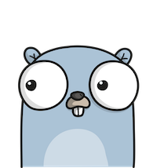

# goggles

&nbsp; 
&nbsp;
&nbsp;

🔭  Goggles is a GUI for your $GOPATH.

## Install

### Stable

Grab the latest release from the [Releases](https://github.com/KyleBanks/goggles/releases) page. 

**Note:** It is currently a known issue that Goggles can only be run via the command-line with `open Goggles.app`, simply double-clicking `Goggles.app` has issues finding your $GOPATH.

### From Source

In order to build and run Goggles, there are a few steps you'll need to take:

1. `go get github.com/KyleBanks/goggles/...`
2. Install [Gallium](https://github.com/alexflint/gallium), in order to bundle the `.app`.
3. Install [npm](https://www.npmjs.com/) and [Gulp](http://gulpjs.com/), in order to build the front-end assets.
4. Run `make` to build and launch the application.

**Note:** Goggles is currently only available for Mac OS. If you'd like to see Goggles available on additional platforms, I encourage you to help contribute to the [Gallium](https://github.com/alexflint/gallium) project.

## Contributing

Contributions to Goggles are very welcome! In order to contribute, either open a new issue for discussion prior to making changes, or comment on an existing ticket indicating that you'd like to take it.

## Author

Goggles was developed by [Kyle Banks](https://twitter.com/kylewbanks).

## Credits

The [Gopher](./_static/img) loading images were created by [Ashley McNamara](https://twitter.com/ashleymcnamara) and inspired by [Renee French](http://reneefrench.blogspot.co.uk/).

## License

Goggles is available under the [Apache 2.0](./LICENSE) license.
