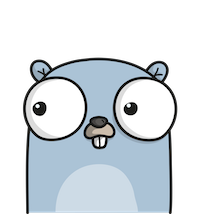

# goggles

[](https://godoc.org/github.com/KyleBanks/goggles)&nbsp; 
[](https://travis-ci.org/KyleBanks/goggles)&nbsp;
[](https://goreportcard.com/report/github.com/KyleBanks/goggles)&nbsp;
[](https://coveralls.io/github/KyleBanks/goggles?branch=master)

🔭  Goggles is a GUI for your $GOPATH.


## Features

- Browse and search local packages
- View package documentation
- Open the project folder in Finder or Terminal
- Open the project repository in your browser
- Displays badges for GoDoc, Goreportcard, and Travis.CI (if .travis.yml is present)

## Install

Goggles can be run in a web browser (cross-platform) or as a standalone application (Mac only).

### Stable (browser & standalone)

Grab the latest release from the [Releases](https://github.com/KyleBanks/goggles/releases) page. 

### From Source (browser mode)

```
$ go get github.com/KyleBanks/goggles/cmd/goggles
$ goggles
```

## Contributing

Contributions to Goggles are very welcome! In order to contribute, either open a new issue for discussion prior to making changes, or comment on an existing ticket indicating that you'd like to take it.

In order to work on Goggles there are a few steps you'll need to take in order to build and run from source:

1. `go get github.com/KyleBanks/goggles/...`
2. Install [npm](https://www.npmjs.com/) and [Gulp](http://gulpjs.com/), in order to build the front-end assets.
3. Install [go-bindata-assetfs](https://github.com/elazarl/go-bindata-assetfs) in order to bundle front-end assets into the Go binary.

#### Web Browser

1. Run `make` to build and run Goggles in your web browser.

#### Standalone (Mac Only)

1. Install [Gallium](https://github.com/alexflint/gallium), in order to bundle the `.app`.
2. Run `make app` to build and launch the application.

**Note:** If you'd like to see Goggles available as a standalone application on additional platforms, I encourage you to help contribute to the [Gallium](https://github.com/alexflint/gallium) project.

## Author

Goggles was developed by [Kyle Banks](https://twitter.com/kylewbanks).

## Thanks

The [Gopher](./static/img) loading images were created by [Ashley McNamara](https://twitter.com/ashleymcnamara) and inspired by [Renee French](http://reneefrench.blogspot.co.uk/).



## License

Goggles is available under the [Apache 2.0](./LICENSE) license.
